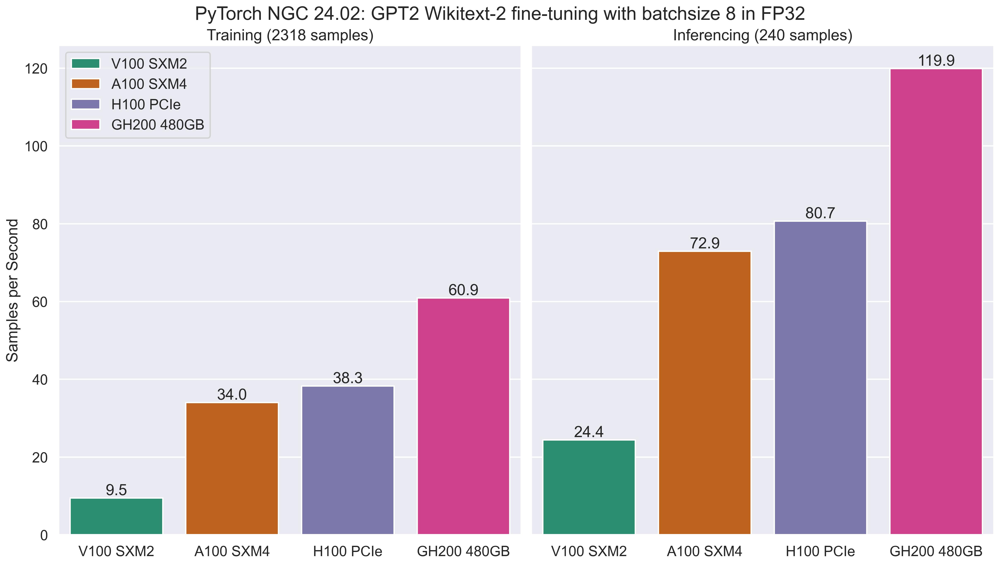

# PyTorch Transformers WikiTest2 Benchmark

Benchmarking of PyTorch LLM training, based on previous work by Farhad Allian ([@f-allian](https://github.com/f-allian)), published at https://notesrcg.blogspot.com/2023/12/blog-post.html

This benchmarks the fine-tuning of GPT-2 (124 million parameters) on the WikiText-2 (raw) dataset, using [HuggingFace Transformers](https://huggingface.co/docs/transformers/en/index) and [PyTorch](https://pytorch.org/) on NVIDIA GPUs.

It uses the Huggingface transformers [`run_clm.py`](https://github.com/huggingface/transformers/blob/main/examples/pytorch/language-modeling/run_clm.py) example to train and evaluate fine-tuning `gpt2` on the `wikitext-2-raw-v1` dataset, with training and evaluation batch sizes of `8` (to allow the benchmark to run on 32GB GPUs).

This repository has only been tested with single-GPU training runs in-mind, using containers [NGC PyTorch containers](https://docs.nvidia.com/deeplearning/frameworks/pytorch-release-notes/index.html) for comparable software environments `x86_64` and `aarch64` machines.

Logs, data and figures are included in `data` for benchmark runs from early 2024 (Note some benchmarks were run with split FP32 and FP16 training, leading to 2 log files rather than one).



## Software environment

Due to binary package availability (`aarch64` binary wheels do not include cuda support at the time of writing) and H100 PCIe performance, a number of software package combinations were used.
These are based on the original set used in the [original blog post](https://notesrcg.blogspot.com/2023/12/blog-post.html), the closest NGC PyTorch equivalent, and a more recent NGC PyTorch version (with improved H100 PCIe performance):

| Software     | Original (conda) | NGC 23.07       | NGC 24.02       |
|--------------|------------------|-----------------|-----------------|
| Python       | 3.10             | 3.10            | 3.10            |
| CUDA         | 12.1             | 12.1.1          | 12.3.2          |
| PyTorch      | 2.1.0            | 2.1.0a0+b5021ba | 2.3.0a0+ebedce2 |
| transformers | 4.35.0           | 4.37.0          | 4.37.0          |
| datasets     | 2.14.5           | 2.14.5          | 2.14.5          |
| evaluate     | 0.4.1            | 0.4.1           | 0.4.1           |

NGC PyTorch containers have supported Hopper since 22.09 with PyTorch `1.13.a0+d0d6b1f`.
`22.11` removed miniconda, instead providing PyTorch installed into the containers python environment. The image definition files in this repository will only work with `22.11+` (and requirements.txt will need adjusting for each version).

The [NGC PyTorch Container release notes](https://docs.nvidia.com/deeplearning/frameworks/pytorch-release-notes/index.html) specify software versions for each NGC container (including the CUDA Toolkit and PyTorch versions).

## Installing Dependencies

This repository contains a number of apptainer/singularity definition files, which are intended to be used to create architecture specific containers to execute the model.
Installation via pip should also be possible, but is not CPU architecture portable due to the lack of CUDA in `aarch64` PyTorch binary wheels, and as such has not been tested.

### Apptainer / Singularity

`transformers-benchmark-23.07.def` and `transformers-benchmark-24.02.def` contain an apptainer/singularity definition file, which is based upon an NGC PyTorch container.
The container definition file(s) which installs additional dependencies, clones HuggingFace Transformers (for `run_clm.py`), and embeds the benchmark script(s).

The containers can be created via:

#### 23.07

```bash
# %test assumes an nvidia gpu is available, hence the need for --nv
apptainer build --nv transformers-benchmark-23.07.sif transformers-benchmark-23.07.def
# Or build without tests
apptainer build --notest transformers-benchmark-23.07.sif transformers-benchmark-23.07.def
```

#### 24.02

```bash
# %test assumes an nvidia gpu is available, hence the need for --nv
apptainer build --nv transformers-benchmark-24.02.sif transformers-benchmark-24.02.def
# Or build without tests
apptainer build --notest transformers-benchmark-24.02.sif transformers-benchmark-24.02.def
```

## Usage via Apptainer/Singularity

Due to differences between Apptainer/Singularity and Docker, a little care must be taken when running these containers to avoid mixing python environments on the host and the container (due to pytorch containers installing into the default user environment).
If you encounter linker errors (likely during `import transformers.pipelines`) when attempting to run the benchmark script, this is the likely cause (due to the use of `-D_GLIBCXX_USE_CXX11_ABI=1` in NGC pytorch containers, but `-D_GLIBCXX_USE_CXX11_ABI=0` in pytorch binary wheels).
This can be avoided using Apptainer/Singularity's `-c,--container`/`-C, --containall` flags.

The following examples all use the `transformers-benchmark-24.02.sif`, this can be substituted for other versions of the container.

The container's `%test` segment can be executed via `apptainer test`. This can be useful to ensure that the container is behaving as intended prior to running the benchmark.

```bash
apptainer test -c -e --bind $(pwd):/mnt --bind ${TMPDIR}:/tmp --env "HF_HOME=/mnt/hf_home" --env "TMPDIR=/tmp/$USER" --nv transformers-benchmark-24.02.sif 
```

To run the benchmark via the apptainer image runscript:

```bash
apptainer run -c -e --bind $(pwd):/mnt --bind ${TMPDIR}:/tmp --env "HF_HOME=/mnt/hf_home" --env "TMPDIR=/tmp/$USER" --nv transformers-benchmark-24.02.sif 
```

Or via an exec command:

```bash
apptainer exec -c -e --bind $(pwd):/mnt --bind ${TMPDIR}:/tmp --env "HF_HOME=/mnt/hf_home" --env "TMPDIR=/tmp/$USER" --nv transformers-benchmark-24.02.sif /opt/run_clm_bench.sh /opt/transformers/examples/pytorch/language-modeling/run_clm.py
```

If you wish to run two instances on a shared filesystem at the same time, ensure you use different host-directories for the bind mount, or different `HF_HOME` environment variables to avoid a race.

## Results extraction and plotting

Output produced by running the benchmark script(s) can be post processed using some python scripts to extract data, and subsequently plotted.

The python dependencies for extraction are plotting are defined in `post-processing/requirements.txt`

```bash
cd post-processing
python3 -m venv .venv
source .venv/bin/activate
python3 -m pip install -r requirements.txt
```

`post-processing/extract-metrics.py` and `post-processing/plot.py` can then be used to extract data into `csv`, and then plotted. For more details see the `--help` option for each python script.

```bash
./extract-metrics.py -i path/to/logs/* -o path/to/extracted-data.csv
./plot -i path/to/extracted-data.csv -o path/to/figure.png --metric samples_per_second --fp32
```

`data/readme.md` shows the commands used to generate the included plots.

## HPC cluster specific notes

Due to the large size of pytorch container images, and the relatively small home directory sizes on HPC systems, it might be best to build these on larger file systems, and set some environment variables (`APPTAINER_CACHEDIR`).


Not all clusters set `${TMPDIR}` to a per user / per job location.
If this is the case, you may wish to manually specify `TMPDIR`, i.e. `TMPDIR=/tmp/${USER}` or `TMPDIR=/tmp/${SLURM_JOB_ID}`.

## Usage without NGC Containers

It should be possible to use non-containerised python installs to run the same benchmark cases, but appropriate versions may not be available, and additional steps performed during container setup (such as cloning `huggingface/transformers`) will be required.

### Pip on x86_64

> **Note** Native pip usage is currently untested. `requirements-24.02.txt` also requires a version of pytorch not yet released on pypi (as of March 2024).

The `requirements-23.07.txt` file may not install the exact same version of PyTorch as included in the NGC container which includes pre-releases.

With a python 3.10 install, including venv and pip (other python versions may work, if binary wheels for all dependencies are available):

```bash
python3 -m venv .venv
source .venv/bin/activate
python3 -m pip install -r requirements-23.07.txt
# Clone transformers into this directory
git clone --depth 1 --branch v4.37.0 https://github.com/huggingface/transformers.git
```

Assuming hugging face transformers has been cloned to the working directory:

```bash
# Source the venv
source .venv/bin/activate
# Ensure pytorch includes CUDA support
python3 -c "import torch;print(torch.cuda.is_available()); print(torch.cuda.get_arch_list())"
# Run the benchmarking script, providing the path to run_clm.py
./run_clm_bench.sh ./transformers/transformers/examples/pytorch/language-modeling/run_clm.py
```
